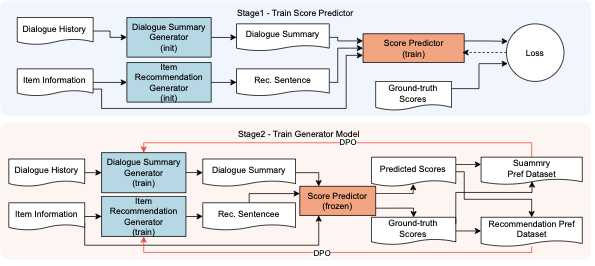

# Refining Text Generation for Realistic Conversational Recommendation via Direct Preference Optimization

This repository contains the implementation code for the research paper "Refining Text Generation for Realistic Conversational Recommendation via Direct Preference Optimization". We propose a method to improve text generation in Conversational Recommender Systems (CRSs) using Direct Preference Optimization (DPO).

## 📖 Overview


*[View high-resolution diagram (PDF)](images/proposal_flow.pdf)*

Traditional Conversational Recommender Systems (CRSs) face challenges such as hasty recommendations in short conversations and insufficient integration of implicit information. This research extends SumRec by applying DPO to optimize both dialogue summary generation and item recommendation information generation models, achieving more realistic and natural conversational recommendation.

### Key Contributions
1. Extension of SumRec using DPO to propose a recommendation method suitable for realistic conversational recommendation datasets
2. Demonstration of superior recommendation performance through comparison with baseline methods and the original SumRec

## 🏗️ System Architecture

### Two-Stage Training Approach
- **Stage 1**: Pre-training of score predictor (DeBERTa)
- **Stage 2**: DPO training for dialogue summary generation and item recommendation information generation models

### Model Configuration
- **Base Model**: Llama-3.1-Swallow-8B-v0.1
- **Score Predictor**: DeBERTa-v3-japanese-large
- **Optimization Method**: Direct Preference Optimization (DPO)

## 📊 Datasets and Model Sources

### Datasets

#### Tabidachi Corpus
- **Source**: https://www.nii.ac.jp/dsc/idr/rdata/Tabidachi/
- **Description**: Travel agent recommendation dialogues (realistic long conversations)
- **Download and Placement**:
  1. Download the dataset from the above link
  2. Place the downloaded files in `data/Tabidachi/annotation_data/`
  
  **Directory structure after placement:**
  ```
  data/Tabidachi/
  └── annotation_data/
      ├── annotations/          # Directory containing dialogue annotation files
      │   └── *.json           # Individual dialogue session files
      ├── spot_info.json        # Tourist spot information
      └── タグ一覧.docx         # Tag list document
  ```

#### ChatRec Dataset
- **Source**: https://github.com/Ryutaro-A/SumRec
- **Description**: Multi-category recommendation dialogues (for comparison)
- **Download and Placement**:
  1. Download the dataset from the GitHub repository
  2. Place the downloaded files in `data/ChatRec/chat_and_rec/`
  
  **Directory structure after placement:**
  ```
  data/ChatRec/
  └── chat_and_rec/
      ├── except_for_travel/    # Non-travel recommendation dialogues
      │   └── *.json
      ├── travel/               # Travel recommendation dialogues
      │   └── *.json
      └── no_restriction/       # General recommendation dialogues
          └── *.json
  ```

### Pre-trained Models
- **Llama-3.1-Swallow-8B-v0.1**: https://huggingface.co/tokyotech-llm/Llama-3.1-Swallow-8B-v0.1
- **DeBERTa-v3-japanese-large**: https://huggingface.co/globis-university/deberta-v3-japanese-large

## 🛠️ Environment Setup

### Requirements
- Python 3.10.12
- GPU: Nvidia A100 80GB × 4 (recommended)
- CUDA-compatible environment

### Setup Instructions

```bash
# Create virtual environment
python -m venv .venv

# Activate environment
source .venv/bin/activate  # Linux/Mac
# or .venv\Scripts\activate  # Windows

# Install dependencies
pip install -r requirements.txt
```

### Key Dependencies
- PyTorch 2.4.1
- Transformers 4.46.2
- TRL (Transformer Reinforcement Learning) 0.12.1
- Optuna 4.1.0
- Datasets 3.1.0
- See `requirements.txt` for complete details

## 📂 Dataset Configuration

This project uses four types of dataset formats:

- **datasets_1**: Recommendation datasets (for dialogue summary generation and item recommendation information generation)
- **datasets_2**: Score predictor training datasets
- **datasets_3**: DPO datasets for dialogue summary generation models
- **datasets_4**: DPO datasets for item recommendation information generation models

### Data Splitting

#### Tabidachi Corpus
- **Splitting Method**: User ID-based
- **Data Composition**:
  - Training data: 20 adults, 7 elderly, 15 children
  - Validation data: 2 adults, 1 elderly, 2 children
  - Test data: 3 adults, 2 elderly, 3 children
- **User ID Ranges**:
  - Adults: 101-125 (25 users)
  - Elderly: 201-210 (10 users)
  - Children: 301-320 (20 users)
- **Scoring**: Actually recommended items = 1, others = 0

#### ChatRec Corpus
- **Splitting Method**: Category-based
- **Data Count by Category**:
  - except_for_travel: 223 items (train: 178, test: 33, validation: 12)
  - travel: 237 items (train: 189, test: 35, validation: 13)
  - no_restriction: 545 items (train: 436, test: 81, validation: 28)
- **Score Conversion**: 
  - Human-predicted scores (1-5 scale by 5 third-party workers) → Scores <3 converted to 0 (dislike), scores ≥3 converted to 1 (like)
  - This conversion unifies the scoring with Tabidachi corpus binary classification

#### Common Specifications
- **Ratio**: Train:Test:Validation = 8:1.5:0.5

## 🚀 Execution Workflow

### A. Tabidachi Experiments

#### Step 1: Dataset Preparation
```bash
# Download Tabidachi dataset and place in data/Tabidachi/annotation_data/
# Then preprocess the raw data
python src/Tabidachi/data_preprocessing.py
```

#### Step 2: Create Training Datasets
```bash
# Execute in order to create all dataset formats
python src/Tabidachi/create_dataset_1.py  # Basic recommendation dataset
python src/Tabidachi/create_dataset_2.py  # Score predictor training data
python src/Tabidachi/create_dataset_3.py  # DPO data for dialogue summary generation
python src/Tabidachi/create_dataset_4.py  # DPO data for item recommendation information
```

#### Step 3: Train Score Predictor
```bash
# Train DeBERTa with method selection
# Method options: proposal, baseline1, baseline2
# - proposal/baseline1: Uses 3 inputs (dialogue summary, item recommendation information, candidate info)
# - baseline2: Uses 2 inputs (dialogue summary, candidate info)
python src/Tabidachi/train_deberta.py --method proposal&baseline1
# Or:
python src/Tabidachi/train_deberta.py --method baseline2

# Output: Model saved to src/Tabidachi/deberta_best_model_[method]/
```

#### Step 4: DPO Training (with Optuna)
```bash
# Train dialogue summary generation model with hyperparameter optimization
python src/Tabidachi/dpo_summary_llm.py         # Creates model 1
python src/Tabidachi/dpo_summary_llm_more.py    # Creates models 2-5
# Output: Models saved as dpo-summary-results_1/, dpo-summary-results_2/, etc.

# Train item recommendation information generation model with hyperparameter optimization
python src/Tabidachi/dpo_recommendation_llm.py      # Creates model 1
python src/Tabidachi/dpo_recommendation_llm_more.py  # Creates models 2-5
# Output: Models saved as dpo-recommendation-results_1/, dpo-recommendation-results_2/, etc.
```

#### Step 5: Generate Recommendations
```bash
# Proposed method (using DPO-trained models)
python src/Tabidachi/create_recommend_data_proposal.py

# Baseline methods for comparison
python src/Tabidachi/create_recommend_data_baseline1.py  # baseline1 = SumRec (from paper)
python src/Tabidachi/create_recommend_data_baseline2.py  # baseline2 = Baseline (from paper)

# Ablation studies (optional)
python src/Tabidachi/create_recommend_data_ablation1.py  # w/o Rec-DPO
python src/Tabidachi/create_recommend_data_ablation2.py  # w/o Sum-DPO
```

#### Step 6: Evaluate Performance
```bash
# Evaluate with method selection
# For proposal/ablation methods: automatically evaluates models 1-5 and computes average
# For baseline methods: evaluates single dataset

# Proposed method (evaluates all 5 models)
python src/Tabidachi/evaluate_from_recommend_data.py --method proposal

# Baseline methods (single dataset each)
python src/Tabidachi/evaluate_from_recommend_data.py --method baseline1
python src/Tabidachi/evaluate_from_recommend_data.py --method baseline2

# Ablation studies (evaluates all 5 models)
python src/Tabidachi/evaluate_from_recommend_data.py --method ablation1
python src/Tabidachi/evaluate_from_recommend_data.py --method ablation2

# Output: HR@k and MRR@k metrics for selected method
```

### B. ChatRec Experiments

#### Step 1: Dataset Preparation
```bash
# Download ChatRec dataset and place in data/ChatRec/chat_and_rec/
# Then preprocess the raw data
python src/ChatRec/data_preprocessing.py
```

#### Step 2: Create Training Datasets
```bash
# Execute in order
python src/ChatRec/create_dataset_1.py  # Basic recommendation dataset
python src/ChatRec/create_dataset_2.py  # Score predictor training data
python src/ChatRec/create_dataset_3.py  # DPO data for dialogue summary generation
python src/ChatRec/create_dataset_4.py  # DPO data for item recommendation information
```

#### Step 3: Train Score Predictor
```bash
# Train DeBERTa with method selection
# Method options: proposal, baseline1, baseline2
# - proposal/baseline1: Uses 3 inputs (dialogue summary, item recommendation information, candidate info)
# - baseline2: Uses 2 inputs (dialogue summary, candidate info)
python src/ChatRec/train_deberta.py --method proposal&baseline1
# Or:
python src/ChatRec/train_deberta.py --method baseline2

# Output: Model saved to src/ChatRec/ChatRec_deberta_best_model_[method]/
```

#### Step 4: DPO Training
```bash
# DPO Training
python src/ChatRec/dpo_summary_llm.py         # Creates model 1
python src/ChatRec/dpo_summary_llm_more.py    # Creates models 2-5
python src/ChatRec/dpo_recommendation_llm.py      # Creates model 1
python src/ChatRec/dpo_recommendation_llm_more.py  # Creates models 2-5
```

#### Step 5: Generate Recommendations and Evaluate
```bash
# Generate recommendation data
python src/ChatRec/create_recommend_data_proposal.py    # Proposed method
python src/ChatRec/create_recommend_data_baseline1.py   # baseline1 = SumRec (from paper)
python src/ChatRec/create_recommend_data_baseline2.py   # baseline2 = Baseline (from paper)

# Evaluate performance with method selection
# For proposal: automatically evaluates models 1-5 and computes average
# For baseline methods: evaluates single dataset

# Proposed method (evaluates all 5 models)
python src/ChatRec/evaluate_from_recommend_data.py --method proposal

# Baseline methods (single dataset each)
python src/ChatRec/evaluate_from_recommend_data.py --method baseline1
python src/ChatRec/evaluate_from_recommend_data.py --method baseline2
```

### C. Crowdworker Evaluation (Tabidachi)

#### Step 1: Train Specialized Model
```bash
# Train model with different data split for crowdworker evaluation
python src/Tabidachi/dpo_summary_llm_cloudworker.py
# Output: Model saved as src/Tabidachi/dpo-summary-results_cloudworker/
```

#### Step 2: Create Evaluation Dataset
```bash
# For baseline method (SumRec - without DPO)
python src/Tabidachi/create_cloudworker_dataset.py --method baseline1
# Output: data/Tabidachi/cloudworker-dataset-baseline1/

# For proposed method (with DPO-trained models)
python src/Tabidachi/create_cloudworker_dataset.py --method proposal
# Output: data/Tabidachi/cloudworker-dataset-proposal/

# Note: The script automatically selects appropriate models:
# - baseline1: Uses base Llama-Swallow models without DPO
# - proposal: Uses DPO-trained models (dpo-recommendation-results_1 and dpo-summary-results_cloudworker)
```

#### Step 3: Conduct Human Evaluation
1. Distribute generated datasets to crowdworkers
2. Collect preference ratings and qualitative feedback
3. Save results in `cloud_worker_tabidachi_datasets.xlsx`

#### Step 4: Analyze Results
```bash
# Analyze crowdworker evaluation results
python metrics_sentence.py
# Computes:
# - Average character length of summaries and recommendations
# - Distinct-1/2 scores for text diversity
# - BLEU and ROUGE scores for text similarity
# - Statistical significance tests
```

## 🔬 Experimental Setup and Evaluation

### Comparison Methods
- **Baseline 1 (baseline1 in code = SumRec in paper)**: Original SumRec method without DPO optimization
- **Baseline 2 (baseline2 in code = Baseline in paper)**: Simple baseline using only dialogue summaries without item recommendation information
- **Proposed Method**: Full implementation with DPO for both summarization and recommendation

**Note**: In the source code, `baseline1` corresponds to "SumRec" and `baseline2` corresponds to "Baseline" as described in the paper.

### Ablation Studies
- **w/o Rec-DPO**: Proposed method without DPO for item recommendation information generation
- **w/o Sum-DPO**: Proposed method without DPO for dialogue summary generation

### Evaluation Metrics

#### Quantitative Metrics
- **Hit Rate (HR)@k**: Proportion of test cases where correct item appears in top-k recommendations
- **Mean Reciprocal Rank (MRR)@k**: Average of reciprocal ranks of correct items
- Evaluated at k = {1, 3, 5}

#### Qualitative Metrics (Crowdworker Evaluation)
- Human preference ratings comparing baseline and proposed methods
- Text quality assessment for naturalness and informativeness
- Analyzed using `metrics_sentence.py` for statistical validation

### Hyperparameter Optimization
- **Tool**: Optuna for automatic hyperparameter search
- **Optimized Parameters**:
  - Learning rate: [1e-7 to 5e-5]
  - Batch size: [1, 2, 4, 8]
  - DPO β parameter: [0.01 to 0.5]
- **Optimization Trials**: 5 trials per model
- **Selection Criteria**: Best validation performance

## 📈 Experimental Results

### Key Results
- **Tabidachi Corpus**: Superior performance across all metrics (HR@1,3,5, MRR@1,3,5) compared to existing methods
- **ChatRec Corpus**: Consistently achieved best performance in MRR

### Important Findings
1. **DPO training for dialogue summary generation is particularly important**: Confirmed through ablation studies
2. **Qualitative improvement in generated text**: More detailed text generation focusing on recommendation-related information
3. **Improvement in top ranks**: Notable performance improvement especially in HR@1, MRR@1

## 📁 File Structure

```
├── src/
│   ├── Tabidachi/                       # Main implementation for Tabidachi
│   │   ├── data_preprocessing.py        # Raw data preprocessing
│   │   ├── create_dataset_1.py          # Basic recommendation dataset creation
│   │   ├── create_dataset_2.py          # Score predictor dataset creation
│   │   ├── create_dataset_3.py          # DPO dataset for dialogue summary generation
│   │   ├── create_dataset_4.py          # DPO dataset for item recommendation information
│   │   ├── train_deberta.py             # DeBERTa score predictor training
│   │   ├── inference_deberta.py         # DeBERTa inference utilities
│   │   ├── dpo_summary_llm.py           # DPO training for dialogue summary generation model (creates model 1)
│   │   ├── dpo_summary_llm_more.py      # Additional DPO training for dialogue summary generation models (creates models 2-5)
│   │   ├── dpo_summary_llm_cloudworker.py # DPO training for crowdworker eval
│   │   ├── dpo_recommendation_llm.py    # DPO training for item recommendation information generation model (creates model 1)
│   │   ├── dpo_recommendation_llm_more.py # Additional DPO training for item recommendation information generation models (creates models 2-5)
│   │   ├── create_recommend_data_proposal.py   # Proposed method recommendation
│   │   ├── create_recommend_data_baseline1.py  # Baseline 1 (SumRec)
│   │   ├── create_recommend_data_baseline2.py  # Baseline 2 (Simple)
│   │   ├── create_recommend_data_ablation1.py  # Ablation: w/o Rec-DPO
│   │   ├── create_recommend_data_ablation2.py  # Ablation: w/o Sum-DPO
│   │   ├── create_cloudworker_dataset.py       # Crowdworker evaluation dataset
│   │   ├── evaluate_from_recommend_data.py     # HR@k, MRR@k evaluation
│   │   ├── oss_llm.py                   # Base LLM wrapper
│   │   ├── rec_model.py                 # Item recommendation information generation model wrapper
│   │   ├── summary_model.py             # Dialogue summary generation model wrapper
│   │   └── [utility scripts]            # create_csv*.py, count_*.py, etc.
│   └── ChatRec/                         # ChatRec implementation
│       ├── data_preprocessing.py        # Raw data preprocessing
│       ├── create_dataset_1.py          # Basic recommendation dataset
│       ├── create_dataset_2.py          # Score predictor dataset
│       ├── create_dataset_3.py          # DPO dataset for dialogue summary generation
│       ├── create_dataset_4.py          # DPO dataset for item recommendation information
│       ├── train_deberta.py             # DeBERTa training
│       ├── inference_deberta.py         # DeBERTa inference
│       ├── dpo_summary_llm.py           # DPO training for dialogue summary generation model (creates model 1)
│       ├── dpo_summary_llm_more.py      # Additional DPO training for dialogue summary generation models (creates models 2-5)
│       ├── dpo_recommendation_llm.py    # DPO training for item recommendation information generation model (creates model 1)
│       ├── dpo_recommendation_llm_more.py # Additional DPO training for item recommendation information generation models (creates models 2-5)
│       ├── create_recommend_data_proposal.py   # Proposed method
│       ├── create_recommend_data_baseline1.py  # Baseline 1
│       ├── create_recommend_data_baseline2.py  # Baseline 2
│       ├── evaluate_from_recommend_data.py     # Evaluation
│       ├── oss_llm.py                   # Base LLM wrapper
│       ├── rec_model.py                 # Item recommendation information generation model
│       ├── summary_model.py             # Dialogue summary generation model
│       └── [utility scripts]            # count_*.py, logger.py
├── data/
│   ├── Tabidachi/                       # Tabidachi datasets
│   │   ├── annotation_data/             # Original downloaded dataset
│   │   ├── processed_data/              # Preprocessed data
│   │   ├── datasets_1/                  # Recommendation datasets
│   │   ├── datasets_2/                  # Score predictor training datasets
│   │   ├── datasets_3/                  # DPO datasets for summarization
│   │   ├── datasets_4/                  # DPO datasets for recommendation
│   │   ├── recommend_data_*/            # Generated recommendation results
│   │   └── cloudworker-dataset*/        # Crowdworker evaluation data
│   └── ChatRec/                         # ChatRec datasets
│       ├── chat_and_rec/                # Original downloaded dataset
│       ├── processed_data/              # Preprocessed data
│       ├── datasets_1/                  # Recommendation datasets
│       ├── datasets_2/                  # Score predictor training datasets
│       ├── datasets_3/                  # DPO datasets for summarization
│       ├── datasets_4/                  # DPO datasets for recommendation
│       └── recommend_data_*/            # Generated recommendation results
├── images/                              # Documentation images
│   ├── proposal_flow.pdf               # Method flow diagram (PDF)
│   └── proposal_flow.png               # Method flow diagram (PNG)
├── metrics_sentence.py                  # Text quality analysis tool
├── cloud_worker_tabidachi_datasets.xlsx # Crowdworker evaluation results
├── requirements.txt                      # Python dependencies
└── README.md                            # This file
```

## 📝 Key Script Descriptions

### Data Preprocessing Scripts
- **`data_preprocessing.py`**: Converts raw annotation data into structured format for experiments
- **`create_dataset_1.py`**: Creates basic recommendation dataset with dialogue-candidate pairs
- **`create_dataset_2.py`**: Generates training data for score predictor (DeBERTa)
- **`create_dataset_3.py`**: Creates preference pairs for dialogue summary generation DPO training
- **`create_dataset_4.py`**: Creates preference pairs for item recommendation information DPO training

### Model Training Scripts
- **`train_deberta.py`**: Trains DeBERTa-based score predictor for recommendation scoring
  - Supports command-line argument `--method [proposal&baseline1|baseline2]`
  - Automatically configures METHOD_FLAG: True for proposal&baseline1, False for baseline2
  - Creates method-specific output directories
- **`dpo_summary_llm.py`**: DPO training for dialogue summary generation model with Optuna hyperparameter optimization (creates model 1)
- **`dpo_summary_llm_more.py`**: Additional DPO training for dialogue summary generation models (creates models 2-5)
- **`dpo_summary_llm_cloudworker.py`**: Special training for crowdworker evaluation with different data split
- **`dpo_recommendation_llm.py`**: DPO training for item recommendation information generation model with Optuna (creates model 1)
- **`dpo_recommendation_llm_more.py`**: Additional DPO training for item recommendation information generation models (creates models 2-5)

### Recommendation Generation Scripts
- **`create_recommend_data_proposal.py`**: Generates recommendations using the proposed DPO-trained models
- **`create_recommend_data_baseline1.py`**: baseline1 = SumRec implementation from paper (no DPO)
- **`create_recommend_data_baseline2.py`**: baseline2 = Baseline from paper (simple method without item recommendation information)
- **`create_recommend_data_ablation1.py`**: Ablation study without recommendation DPO (w/o Rec-DPO)
- **`create_recommend_data_ablation2.py`**: Ablation study without summarization DPO (w/o Sum-DPO)
- **`create_cloudworker_dataset.py`**: Creates specialized dataset for human evaluation

### Evaluation Scripts
- **`evaluate_from_recommend_data.py`**: Computes HR@k and MRR@k metrics for all methods
  - Supports command-line argument `--method` for method selection
  - For Tabidachi: proposal, baseline1, baseline2, ablation1, ablation2
  - For ChatRec: proposal, baseline1, baseline2
  - Automatically reads datasets 1-5 for proposal/ablation methods
- **`metrics_sentence.py`**: Analyzes text quality with multiple metrics:
  - Average character length of summaries and recommendations
  - Distinct-1/Distinct-2 scores for diversity measurement
  - BLEU and ROUGE scores for text similarity
  - Processes crowdworker evaluation results from `cloud_worker_tabidachi_datasets.xlsx`

### Model Wrapper Classes
- **`oss_llm.py`**: Base wrapper for Llama-3.1-Swallow model
- **`rec_model.py`**: Wrapper for item recommendation information generation model
- **`summary_model.py`**: Wrapper for dialogue summary generation model
- **`inference_deberta.py`**: Utilities for DeBERTa score prediction

## 🔄 Complete Experiment Reproduction Guide

### Quick Start: Reproduce Paper Results

#### For Tabidachi Experiments
```bash
# 1. Prepare environment
python -m venv .venv
source .venv/bin/activate
pip install -r requirements.txt

# 2. Download and place dataset
# Download from https://www.nii.ac.jp/dsc/idr/rdata/Tabidachi/
# Place in data/Tabidachi/annotation_data/

# 3. Run complete pipeline
cd src/Tabidachi
bash ../../scripts/run_tabidachi_experiments.sh  # If script exists
# Or run manually:
python data_preprocessing.py
python create_dataset_1.py && python create_dataset_2.py
python create_dataset_3.py && python create_dataset_4.py
python train_deberta.py --method proposal&baseline1  # or baseline2
python dpo_summary_llm.py          # Creates model 1
python dpo_summary_llm_more.py     # Creates models 2-5
python dpo_recommendation_llm.py       # Creates model 1
python dpo_recommendation_llm_more.py  # Creates models 2-5
python create_recommend_data_proposal.py
python create_recommend_data_baseline1.py
python create_recommend_data_baseline2.py
python evaluate_from_recommend_data.py --method proposal  # Evaluate proposed method
```

#### For ChatRec Experiments
```bash
# 1. Download and place dataset
# Clone from https://github.com/Ryutaro-A/SumRec
# Place data in data/ChatRec/chat_and_rec/

# 2. Run complete pipeline
cd src/ChatRec
python data_preprocessing.py
python create_dataset_1.py && python create_dataset_2.py
python create_dataset_3.py && python create_dataset_4.py
python train_deberta.py --method proposal&baseline1  # or baseline2
python dpo_summary_llm.py          # Creates model 1
python dpo_summary_llm_more.py     # Creates models 2-5
python dpo_recommendation_llm.py       # Creates model 1
python dpo_recommendation_llm_more.py  # Creates models 2-5
python create_recommend_data_proposal.py
python create_recommend_data_baseline1.py
python create_recommend_data_baseline2.py
python evaluate_from_recommend_data.py --method proposal  # Evaluate proposed method
```

### Model Output Locations

#### Tabidachi Models
- DeBERTa: `src/Tabidachi/deberta_best_model_proposal&baseline1/` or `deberta_best_model_baseline2/`
- DPO Summary: `src/Tabidachi/dpo-summary-results_[1-5]/`
- DPO Recommendation: `src/Tabidachi/dpo-recommendation-results_[1-5]/`
- Cloudworker Model: `src/Tabidachi/dpo-summary-results_cloudworker/`

#### ChatRec Models
- DeBERTa: `src/ChatRec/ChatRec_deberta_best_model_proposal&baseline1/` or `ChatRec_deberta_best_model_baseline2/`
- DPO Summary: `src/ChatRec/dpo-summary-results_[1-5]/`
- DPO Recommendation: `src/ChatRec/dpo-recommendation-results_[1-5]/`

### Results Output Locations
- Tabidachi recommendations: `data/Tabidachi/recommend_data_[method]/`
- ChatRec recommendations: `data/ChatRec/recommend_data_[method]/`
- Evaluation results: Console output and wandb logs

## 💻 Runtime Considerations

### GPU and Memory Requirements
- **Minimum**: Nvidia V100 32GB × 2
- **Recommended**: Nvidia A100 80GB × 4
- **Training Times** (with A100 × 4):
  - Llama-3.1-Swallow-8B DPO: ~24 hours per model
  - DeBERTa: ~4 hours
  - Optuna optimization (5 trials): ~5 days total

### Storage Requirements
- Models: ~50GB per DPO model
- Datasets: ~10GB
- Total recommended: 500GB+ free space

### Paper Citation
**To be added**

---

**Note**: This implementation is created for research purposes. For commercial use, please verify the licenses of each model and dataset.